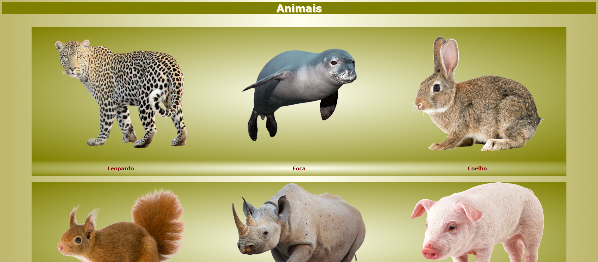
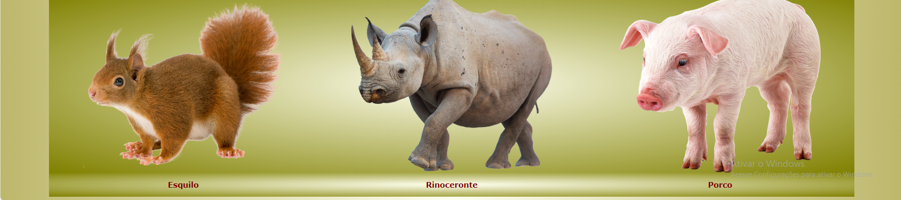
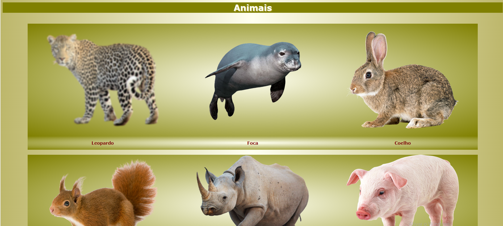

# atividadeCSS-Animais
atividade de CSS feita em aula - site com uns animais e uns efeitos.
  

  <h3>Uma página normal de css com uns animais.</h3>
    

  

  <h3>Se passar o mouse em cima, a imagem fica com blur.</h3>
  

